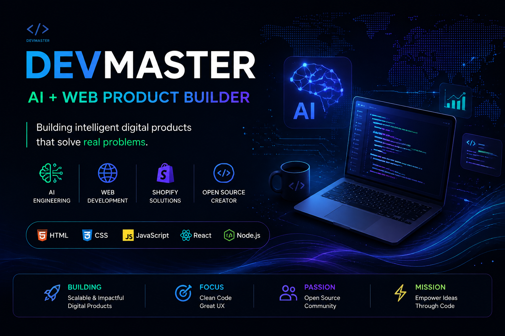

 

# 👋 Hey, I'm Devmaster 🚀

### 🚀 AI + Web Product Builder

## 🚀 AI + Web Product Builder

I build intelligent digital products combining **Artificial Intelligence, modern web technologies, and scalable platforms.**

My focus:

🤖 **AI Engineering**
- AI-powered applications
- Automation workflows
- Intelligent productivity tools

🌐 **Web Products**
- Modern frontend experiences
- Interactive dashboards
- Scalable web applications

🛒 **Commerce Platforms**
- Shopify development
- Custom ecommerce solutions
- CMS architectures

⚡ **Open Source**
- Building public projects
- Improving developer experience
- Sharing knowledge

---
## 🏆 GitHub Achievements

---
# 🚀 Featured Projects

## 🧠 MeetMind Pro

AI Meeting Intelligence Workspace

✨ Features:
- Transcript Analysis
- AI Summaries
- Action Detection
- Voice Capture
- Meeting Analytics

🛠 Tech:
HTML • CSS • JavaScript

---

## 📄 ResumeCraft

Modern Resume Builder

✨ Features:
- Live Preview
- Dynamic Sections
- PDF Export
- Responsive Design

🛠 Tech:
HTML • CSS • JavaScript

---

## 💰 Expense Tracker

Personal Finance Management App

✨ Features:
- Transaction Management
- Budget Tracking
- Dashboard Analytics
- Local Storage

🛠 Tech:
HTML • CSS • JavaScript

# 🛠 Tech Stack

## 🎨 Frontend Development

  

## ⚙️ Backend & APIs

  

## 🛒 CMS & Ecommerce Platforms

  

## 🗄️ Databases & Storage

  

## 🤖 AI & Automation

  

## ☁️ Cloud & DevOps

  

## 🎨 Design & Collaboration

  

## 🔧 Development Tools

# 📊 GitHub Analytics

# 📈 Contribution Activity

# 🌱 Currently Learning

🤖 AI Engineering

⚛️ Advanced JavaScript

☁️ Cloud Architecture

🔧 Open Source Development

# 🤝 Connect With Me

⭐ Thanks for visiting my profile!

## 🐍 Contribution Snake

